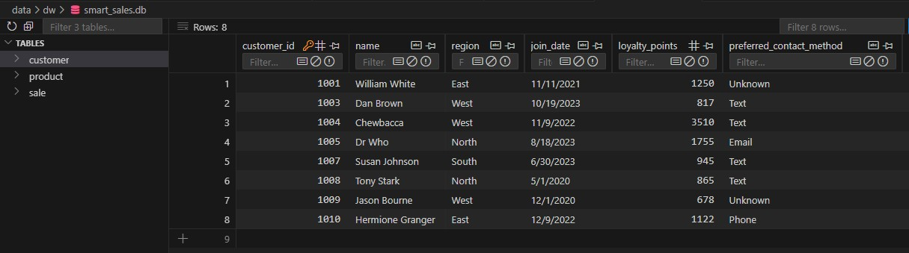
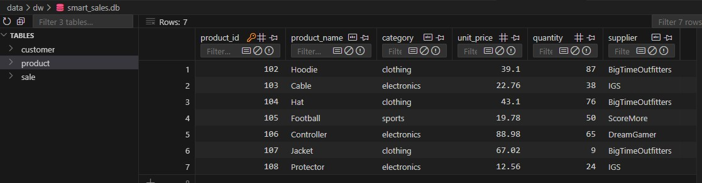
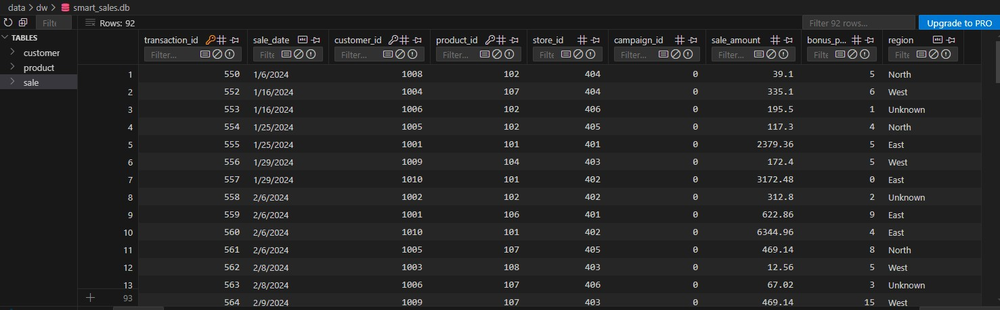
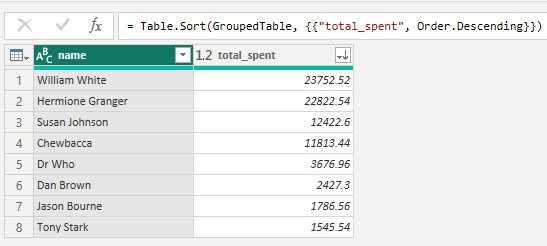
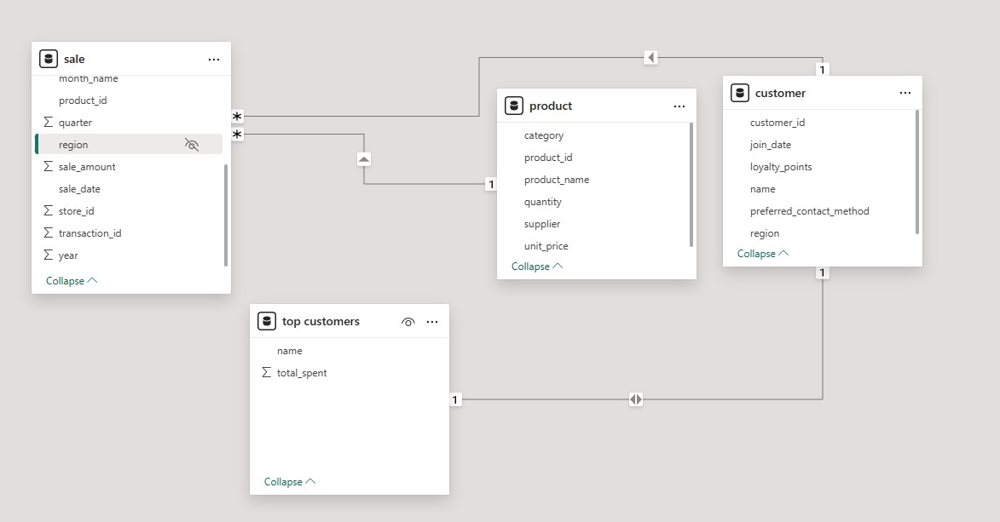
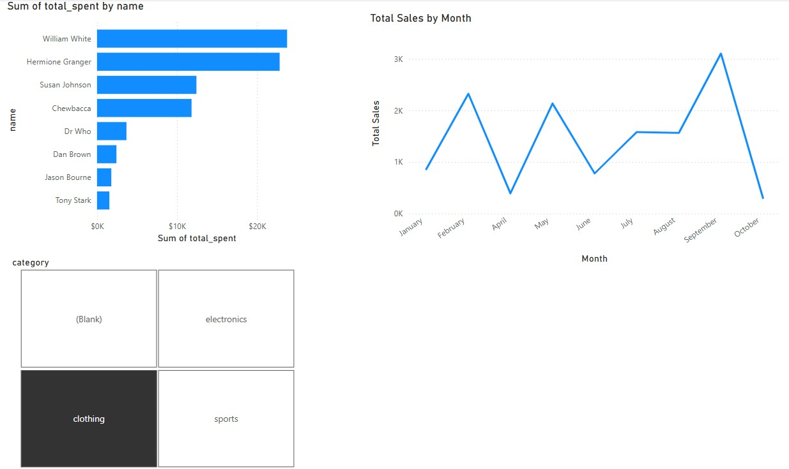
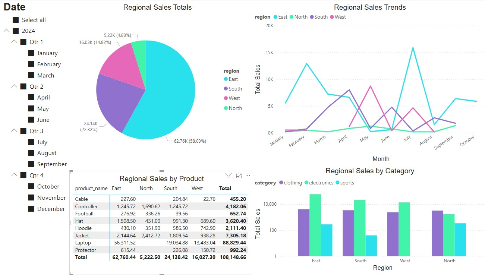

# smart-store-kjleopold
BI and Analytics Project

## Project Setup
### 1. Create a Repository in GitHub
1. Name repository smart-store-kjleopold.
2. Make sure Public is selected.
3. Make sure to add README.md.
4. Create repository.

### 2. Clone Repo to Local
1. Copy URL to the GitHub Repository.
2. Open a terminal in the root (Project) folder.
3. Enter into terminal:
```
git clone (past URL)
```
4. Check that everything cloned as expected.

### 3. Create .gitignore and requirements.txt
1. Create new file in root project folder named: `.gitignore`
2. Create new file in root project folder named: `requirements.txt`
3. Find `.gitignore` file in course repo and copy/paste into local `.gitignore`
4. Find `requirements.txt` file in course repo and copy/paste into local `requirements.txt`

### 4. Git Add/Commit/Push
```
git add .
git commit -m "Add meaningful comment"
git push
```

### 5. Create Virtual Environment
1. From the root project folder:
```
py -m venv .venv
```
2. Accept VS Code suggestions.

### 6. Activate Virtual Environment
```
.venv\Scripts\activate
```

### 7. Install Dependencies
1. Verify .venv is activated (will have a green .venv in terminal)
2. Enter the following commands in PowerShell:
```
py -m pip install --upgrade pip setuptools wheel
py -m pip install -r requirements.txt
```

### 8. Select VS Code Interperter
1. Open the Command Pallette: `Ctrl+Shift+P`
2. Search for "Python: Select Interpreter"
3. Select local .venv option
4. Restart terminal
5. Activate .venv

### 9. Create Folders
1. data
   - raw
   - prepared
2. scripts
3. utils

### 10. Download Data Files
Find raw data .csv files in course repo and download to data\raw folder
- customers_data.csv
- products_data.csv
- sales_data.csv

### 11. Download and Install Power BI

### 12. Create logger.py and data_prep.py
1. Create `logger.py` file under utils folder
2. Find `logger.py` file in course repo and copy/paste contents into local `logger.py`
3. Create `data_prep.py` file under scripts folder
4. Find `data_prep.py` file under `smart-sales-starter-files` repo and copy/paste into local `data_prep.py`
5. Execute Python script:
```
py scripts\data_prep.py
```

### 13. Data Collection
1. Add to `customers_data.csv`: LoyaltyPoints and PreferredContactMethod columns
2. Add to `products_data.csv`: Quantity and Supplier columns
3. Add to `sales_data.csv`: BonusPoints and State
4. Add fake data to all the new columns
   
### 14. Data Cleaning & ETL Preparation
1. Create `data_preparation` subfolder in the `scripts` folder
2. Create a Python file fr each table
   * prepare_customers_data.py
   * prepare_products_data.py
   * prepare_sales_data.py
3. Copy/paste the Module 3 example scripts found in GitHub into each Python file
4. Make adjustments to the scripts as needed to clean the raw data files

### 15. Prepare Data for ETL
1. Create `data_scrubber.py` file in the `data_preparation` folder
2. Copy/Paste the example `data_scrubber.py` from GitHub into the new file
3. Complete the TODO within the `data_scrubber.py`
4. Create `tests` folder in the root project folder
5. Create `test_data_scrubber.py` file in the `tests` folder
6. Copy/Paste the example `test_data_scrubber.py` from GitHub into the new file
7. Run the test script from the root project folder
```
py tests\test_data_scrubber.py
```
8. Make sure all tests pass
9. DataScrubber can now be added to `data_preparation` files

### 16. Complete Data Preparation
1. Run `data_prep.py`

### 17. Design Data Warehouse
1. Create schema using the Star Schema
* Fact Table: Sales
   - Primary Key: transaction_id
   - Foreign Keys: customer_id and product_id
* Dimension Tables: Customers, Products
   - Primary Keys: customer_id, product_id
* Dates work best as TEXT data type in SQLite

### 18. Create Data Warehouse
1. Define the schema for the fact and dimension tables
2. Ensure fact table includes foreign keys that reference the primary keys of the dimension tables
3. Follow conventions for naming tables and columns
4. Run the python file to create the `dw` folder with the `smart_sales.db` data warehouse
```
py scripts\create_dw.py
```

### 19. Implement DW
* Add the data from the prepared CSV files to the data warehouse
```
py scripts\etl_to_dw.py
```

Examples:




### 20. Power BI Query and Dashboard
* The below code was used to transform the customer data table to a table that sorted the customers by the amount they spent. ChatGPT was a big help with converting the SQL code to M code for use in Power BI Advanced Editor.
```
let
    // Connect to the data source
    Source = Odbc.DataSource("dsn=SmartSalesDSN", [HierarchicalNavigation=true]),

    // Load the sale and customer tables
    sale_Table = Source{[Name="sale", Kind="Table"]}[Data],
    customer_Table = Source{[Name="customer", Kind="Table"]}[Data],

    // Join sale with customer on customer_id
    MergedTables = Table.NestedJoin(sale_Table, "customer_id", customer_Table, "customer_id", "CustomerData", JoinKind.Inner),

    // Expand the customer name from the joined table
    ExpandedTable = Table.ExpandTableColumn(MergedTables, "CustomerData", {"name"}),

    // Group by customer name and sum the sale_amount
    GroupedTable = Table.Group(ExpandedTable, {"name"}, {{"total_spent", each List.Sum([sale_amount]), type number}}),

    // Sort the results by total_spent in descending order
    SortedTable = Table.Sort(GroupedTable, {{"total_spent", Order.Descending}})
in
    SortedTable
```

* This is the resulting table.  


* This screenshot represents the model view for my tables.


* This screenshot represents the final dashboard I came up with.


## Module 6 OLAP Project
1. Business Goal: To identify sales trends by region across different categories and products.
2. Data Source: This project utilizes a data warehouse through an ODBC connection as well as a pre-computed cube.
* Product Table Columns (data warehouse): `product_name`, `category`  
* Multidimensional OLAP Cube Columns (pre-computed cube): `month_name`, `region`, `sale_amount_sum`
3. Tools: Power BI was used to get more practice with the capabilities the platform has to offer.
4. Workflow & Logic  
* Dimensions used:  
  * Category: Broad classification of products
  * Product Name: Specific items sold
  * Region: Geographic sales areas
  * Time: Includes Year, Quarter, and Month via date hierarchy
* Metrics used:
  * Total Sales Amount: aggregated using SUM(sale_amount_sum)
* OLAP Techniques Applied:  
  * Slicing: Time-based slicing across Year, Quarter, and Month
  * Dicing: Focused analysis on combinations of Region and Product
  * Drilldown: Enabled through a date hierarchy for time-based exploration
* Logic:  
  * Data is structured around key business dimensions (Region, Product, Time, and Category) and aggregated by total sales.
  * A date hierarchy is implemented to allow drilldown from Year to Month.
  * Filtering and grouping logic is applied to compare regional and product-level sales trends.
  * Data model relationships support cross-filtering between categories, products, and regions for deeper analysis.  
5. Results  
* Pie Chart – Total Sales by Region  
  * Insight: The East region contributes over 50% of total sales, dominating all other regions.
  * Takeaway: The North region underperforms, making up less than 5% of sales. South and West contribute 22% and 15%, respectively.  
* Line Chart – Sales Trends Over Time (by Region)  
  * Insight: The South and West regions follow similar trends, with the West peaking one month later.
  * Takeaway: The East region experiences a sharp drop in May, followed by a major rebound in June–July. North remains stable.  
* Matrix – Product Sales by Region  
  * Insight: Laptops are the top-selling product in all applicable regions, even though they're not available in every region.
  * Takeaway: Cables consistently underperform across the board.  
* Bar Chart – Product Category Sales by Region  
  * Insight: Electronics lead in every region except the North, where Clothing takes the top spot.
  * Takeaway: Sports is the lowest-selling category in all regions.  

6. Suggested Business Actions  
Based on the analysis, the East region should be prioritized for continued investment, as it drives over 50% of total sales, while the North region may benefit from targeted marketing or promotional efforts to improve performance. The mid-year dip in East region sales suggests a need for proactive seasonal planning, and the similar trends in the South and West regions present an opportunity to coordinate inventory and campaign timing. High-performing products like laptops should be further promoted or bundled to increase value, while underperforming items like cables may require repositioning or removal. Electronics consistently lead across regions, while clothing performs best in the North and sports products underperform overall—indicating that regional product strategies should be refined to match demand patterns.
7. Challenges: I had put in a lot of work to learn Power BI after the last module, so I didn't really run into any challenges or issues with this module. 

